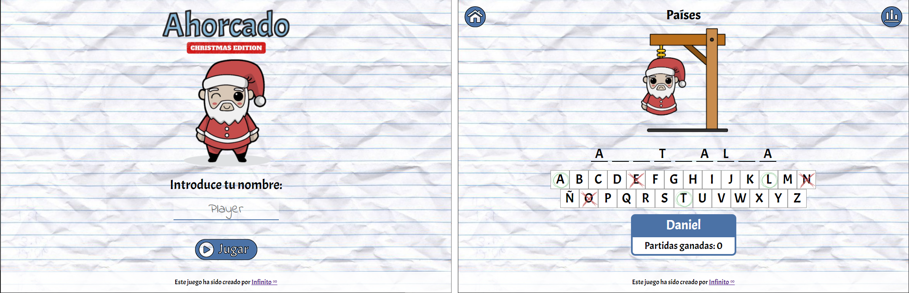

# El ahorcado

## Descripción

Juego clásico del ahorcado. El jugador ha de adivinar la palabra antes de perder todas las vidas.

La aplicación sigue los principios del diseño responsive, está en formato ordenador y móvil. Utiliza ventanas modales para mostrar los eventos de juego. Permite poner el nombre del jugador y lo muestra por pantalla, almacenando el número de partidas ganadas en el local Storage. También permite visualizar un ranking de los 5 mejores jugadores.

## Caracerísticas

* HTML5, CSS3, JS
* SCSS
* LocalStorage
* Metodología BEM

## Colaboraciones

